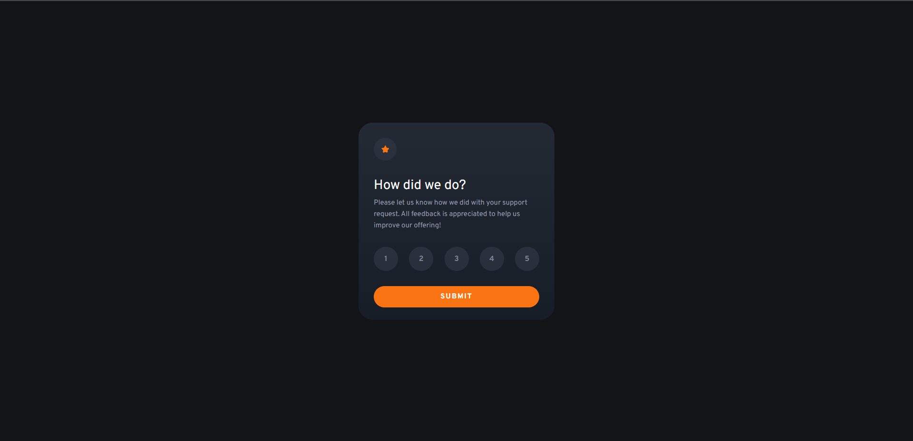

# Frontend Mentor - Interactive rating component solution

This is a solution to the [Interactive rating component challenge on Frontend Mentor](https://www.frontendmentor.io/challenges/interactive-rating-component-koxpeBUmI). Frontend Mentor challenges help you improve your coding skills by building realistic projects. 

## Table of contents

- [Overview](#overview)
  - [The challenge](#the-challenge)
  - [Screenshot](#screenshot)
  - [Links](#links)
- [My process](#my-process)
  - [Built with](#built-with)
  - [Continued development](#continued-development)
- [Author](#author)

## Overview

### The challenge

Users should be able to:

- View the optimal layout for the app depending on their device's screen size
- See hover states for all interactive elements on the page
- Select and submit a number rating
- See the "Thank you" card state after submitting a rating

### Screenshot

### Links

- Solution URL: [Solution](https://github.com/BerqiaMouad/interactive-rating-component)
- Live Site URL: [Live Url](https://toaddlater.com)

## My process

### Built with

- Semantic HTML5 markup
- CSS custom properties
- Flexbox
- CSS Grid
- JavaScript

### Continued development

I would like to try to implement the same component using React in the future, I still dont have 
the required skills to do it properly.

## Author

- Website - [Mouad Berqia](https://www.berqiamouad.me/)
- Frontend Mentor - [@BerqiaMouad](https://www.frontendmentor.io/profile/BerqiaMouad)
- LinkedIn - [@berqiamouad](https://www.linkedin.com/in/berqiamouad/)

